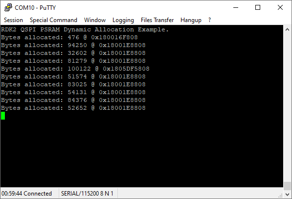
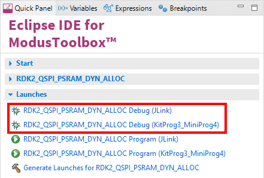

# RutDevKit-PSoC62 QSPI PSRAM Dynamic Allocation Example

Rutronik Development Kit Programmable System-on-Chip CY8C6245AZI-S3D72 "QSPI PSRAM Dynamic Allocation" Example. 

This example demonstrates how to configure and use the PSRAM APS6404L-3SQR-ZR  with standard dynamic memory allocation functions such as malloc() etc.

 

### Using the code example with a ModusToolbox IDE:

1. Import the project: **File** > **Import...** > **General** > **Existing Projects into Workspace** > **Next**.
2. Select the directory where **"RutDevKit-PSoC62_QSPI_PSRAM_DYN_ALLOC"** resides and click  **Finish**.
3. Select and build the project **Project ** > **Build Project**.

### Operation

The PSRAM is configured to work in XIP (memory mapped) mode before the any dynamic allocation operation can take place. The limited range of random numbers are generated to allocate variable amount of space in the external memory on every cycle. The allocated memory can be tested additionally by defining the `TEST_ALLOC_MEM`. After the allocation and/or testing is complete the allocated memory is freed. This cycle is infinite in a given example. 

The randomized memory allocation size could be turned off by defining the `ALLOC_FIXED_SIZE`  value to the fixed size (up to 8MB). 

The custom **_sbrk()** function needs to be provided for standard memory allocators as malloc() or calloc(). The mentioned function is provided in the example project "sbrk.c" file.  Its purpose is to expand the memory to the external PSRAM memory locations defined by `PSRAM_START_ADDR` and `PSRAM_END_ADDR` definition in "sbrk.c" file. 

The results can be seen on the terminal output from the KitProg3 UART and monitoring the user LEDs.

The QSPI interface in configured using HAL library and the SMIF is configured and initiated using PDL libraries in the function:

`void Init_SMIF(void)`

The APS6404L-3SQR-ZR PSRAM memory configuration structures are generated by the "QSPI Configurator":

### Debugging

If you successfully have imported the example, the debug configurations are already prepared to use with a the KitProg3, MiniProg4, or J-link. Open the ModusToolbox perspective and find the Quick Panel. Click on the desired debug launch configuration and wait until the programming completes and debugging starts.

## Legal Disclaimer

The evaluation board including the software is for testing purposes only and, because it has limited functions and limited resilience, is not suitable for permanent use under real conditions. If the evaluation board is nevertheless used under real conditions, this is done at one’s responsibility; any liability of Rutronik is insofar excluded. 

